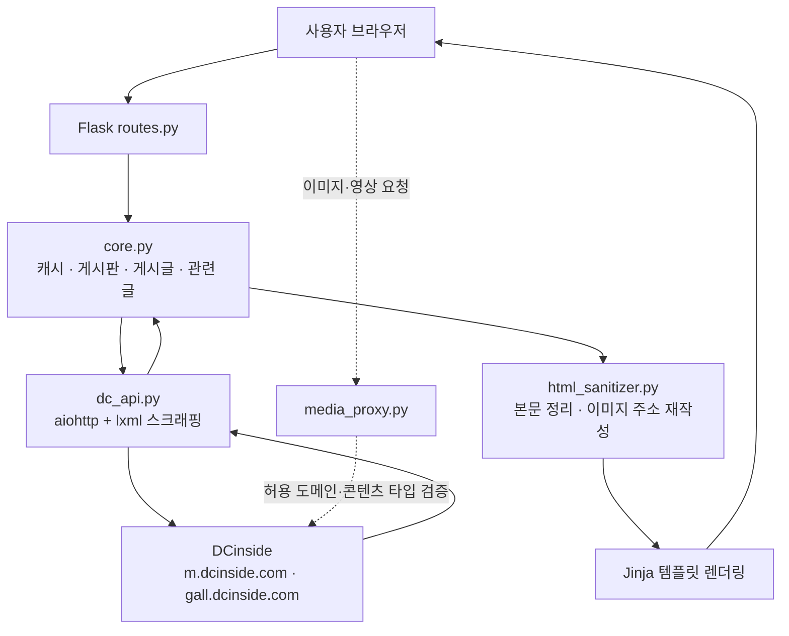

<div align="center">

# 🪞 DCinside Web Mirror

### DCinside 갤러리를 더 조용하고, 빠르고, 깔끔하게 읽는 Flask 기반 웹 미러

복잡한 원본 화면 대신 글·이미지·댓글에 집중할 수 있도록 만든 경량 프록시 뷰어입니다.<br />
흥한 갤러리, 게시판 목록, 본문 읽기, 댓글, 미디어 프록시, 최근 방문 기록까지 한 흐름으로 제공합니다.

<br />

[](https://www.python.org/)
[](https://flask.palletsprojects.com/)
[](https://gunicorn.org/)
[](https://pm2.keymetrics.io/)

<br />

[빠른 시작](#quick-start) · [주요 기능](#features) · [구조](#structure) · [환경변수](#environment) · [배포](#deployment)

</div>

---

## ✨ 한눈에 보기

| 구분 | 내용 |
|---|---|
| **목표** | DCinside 갤러리를 광고와 잡음 없이 읽기 좋은 화면으로 보여주기 |
| **방식** | Flask가 요청을 받고, 비동기 스크래퍼가 DCinside HTML을 가져와 정리한 뒤 렌더링 |
| **강점** | 빠른 목록 조회, 안정적인 이미지 표시, 읽음 상태 저장, 관련 글 이어보기 |
| **배포** | 로컬 개발 서버, Gunicorn, PM2, GitHub Actions 자동 배포 구성 |

---

<a id="quick-start"></a>

## 🚀 빠른 시작

### 1. 설치

```bash
git clone https://github.com/oneulddu/dcinside-web-mirror.git
cd dcinside-web-mirror

python3 -m venv .venv
source .venv/bin/activate

python3 -m pip install -r requirements.txt
```

### 2. 환경변수 준비

```bash
cp .env.example .env
```

`.env.example`은 운영 배포 기본값이라 그대로 실행하면 `MIRROR_ENV=production`, `MIRROR_HOST=::`, `MIRROR_PORT=6100` 기준으로 뜹니다. 로컬 빠른 시작은 `.env`를 아래처럼 바꿔 주세요.

```dotenv
MIRROR_ENV=development
MIRROR_HOST=127.0.0.1
MIRROR_PORT=8080
```

운영 환경에서는 `MIRROR_SECRET_KEY`를 반드시 안전한 임의 문자열로 바꿔 주세요.

### 3. 실행

```bash
python3 run.py
```

또는 Makefile을 사용할 수 있습니다.

```bash
make install      # 의존성 설치
make run          # 개발 서버 실행
make test         # 테스트 실행
make run-prod     # Gunicorn 실행
```

기본 개발 서버 주소는 **http://127.0.0.1:8080** 입니다.

---

<a id="features"></a>

## 🌟 주요 기능

| 기능 | 설명 |
|---|---|
| 🔥 **흥한 갤러리** | 대흥갤·흥한갤 목록을 가져와 첫 화면에서 보여줍니다. |
| 🔎 **갤러리 검색** | 갤러리 이름이나 게시판 ID로 빠르게 이동할 수 있습니다. |
| 📋 **게시판 목록** | 전체글·추천글 전환, 페이지 이동, 검색어 하이라이트를 지원합니다. |
| 📖 **게시글 읽기** | 본문, 이미지, 댓글, 대댓글을 읽기 좋은 화면으로 정리합니다. |
| 🖼️ **미디어 프록시** | DCinside 이미지·영상·디시콘을 서버에서 대신 가져와 안정적으로 표시합니다. |
| 🔗 **관련 글 이어보기** | 현재 글 주변의 게시글을 자연스럽게 이어서 탐색할 수 있습니다. |
| 🕘 **최근 방문 갤러리** | 쿠키 기반으로 최근 방문한 갤러리를 최대 30개까지 보관합니다. |
| 🌙 **테마 유지** | 라이트·다크 테마 전환 상태를 브라우저에 저장합니다. |
| ✅ **읽음 표시** | 이미 읽은 게시글을 시각적으로 구분합니다. |
| 🛡️ **댓글 스팸 필터** | 클라이언트에서 반복성 댓글 스팸을 줄여 보여줍니다. |

---

## 🧭 화면과 주소

| 화면 | 주소 | 설명 |
|---|---|---|
| 홈 | `/` | 흥한 갤러리와 갤러리 검색 |
| 최근 방문 | `/recent` | 최근 방문한 갤러리 목록 |
| 게시판 | `/board?board=airforce&page=1` | 게시글 목록 |
| 게시글 | `/read?board=airforce&pid=12345` | 본문과 댓글 |
| 관련 글 API | `/read/related` | 관련 게시글 추가 로딩용 JSON |
| 미디어 프록시 | `/media` | 이미지·디시콘 프록시 |
| 영상 프록시 | `/movie` | DCinside 영상 프록시 |

---

<a id="structure"></a>

## 🏗️ 프로젝트 구조

```text
mirror/
├── app/
│   ├── __init__.py                 # Flask 앱 팩토리
│   ├── config.py                   # 개발·운영 설정
│   ├── routes.py                   # 화면 라우트, 미디어 프록시 연결, HTML 정리
│   ├── services/
│   │   ├── async_bridge.py         # Flask 동기 흐름과 async 작업 연결
│   │   ├── core.py                 # 게시판·게시글·관련 글 조회와 캐시 로직
│   │   ├── dc_api.py               # DCinside 비동기 스크래핑
│   │   ├── heung.py                # 흥한 갤러리 조회와 파일 캐시
│   │   ├── html_sanitizer.py       # 본문 HTML 정리와 이미지 주소 재작성
│   │   ├── media_proxy.py          # 이미지·영상 프록시와 보안 검증
│   │   └── recent.py               # 최근 방문 갤러리 쿠키 관리
│   ├── templates/
│   │   ├── base.html               # 공통 레이아웃
│   │   ├── index.html              # 홈
│   │   ├── board.html              # 게시판 목록
│   │   ├── read.html               # 게시글 읽기
│   │   └── recent.html             # 최근 방문
│   └── static/
│       ├── css/main.css            # 전체 스타일
│       └── javascript/
│           ├── read_state.js       # 테마와 읽음 상태
│           ├── read_related_loader.js
│           └── comment_spam_filter.js
├── tests/                          # 테스트
├── docs/                           # 문서
├── legacy/                         # 이전 버전 코드
├── run.py                          # 개발 서버 진입점
├── wsgi.py                         # Gunicorn 진입점
├── gunicorn.conf.py                # Gunicorn 설정
├── ecosystem.config.js             # PM2 설정
├── Makefile                        # 개발 편의 명령어
├── requirements.txt                # 실행 의존성
└── requirements-dev.txt            # 개발·테스트 의존성
```

---

## ⚙️ 작동 방식



### 내부 흐름

1. 사용자가 게시판이나 글 주소에 접속합니다.
2. Flask 라우트가 요청값을 검증하고 비동기 작업을 실행합니다.
3. `core.py`가 캐시를 확인한 뒤 필요한 데이터만 `dc_api.py`에 요청합니다.
4. 스크래퍼가 DCinside HTML을 가져오고 게시글·댓글·이미지 정보를 추출합니다.
5. 본문 HTML은 허용된 태그와 속성만 남기고 안전하게 정리됩니다.
6. 이미지는 `/media`, 영상은 `/movie` 프록시 주소로 바뀌어 브라우저에 전달됩니다.

---

## 🧠 핵심 설계 포인트

### 비동기 스크래핑

`aiohttp`와 `lxml`을 사용해 게시판 목록, 게시글, 댓글, 작성자 코드 조회를 비동기로 처리합니다. Flask의 동기 라우트 안에서는 `async_bridge.py`가 안전하게 비동기 작업을 이어 줍니다.

### 여러 단계 캐시

- 흥한 갤러리 파일 캐시
- 최신 글 ID 캐시
- 관련 글 탐색 캐시
- 작성자 코드 캐시
- 최근 방문 갤러리 쿠키와 서버 보조 캐시

자주 반복되는 요청을 줄여 응답 속도와 안정성을 높입니다.

### 관련 글 탐색

현재 글의 위치를 기준으로 주변 페이지를 탐색하고, 부족한 경우 뒤쪽 페이지를 보충 조회해 자연스러운 이어보기를 만듭니다.

### 안전한 미디어 프록시

DCinside의 이미지 접근 제한을 우회하기 위해 서버가 미디어를 대신 가져옵니다. 이때 허용 도메인, DNS 결과, 리다이렉트, 응답 크기, 콘텐츠 타입을 함께 검증합니다.

---

## 🛠️ 기술 스택

| 영역 | 사용 기술 |
|---|---|
| 서버 | Python, Flask, Gunicorn |
| 비동기 통신 | aiohttp, asgiref |
| HTML 처리 | lxml, BeautifulSoup4 |
| 화면 | Jinja2, Vanilla JavaScript, CSS, Pretendard |
| 프로세스 관리 | PM2 |
| 테스트 | pytest, pytest-asyncio |
| 배포 자동화 | GitHub Actions |

---

<a id="environment"></a>

## ⚙️ 환경변수

`.env.example`을 복사해 `.env`를 만든 뒤 필요한 값만 바꾸면 됩니다.

| 변수 | 기본값 | 설명 |
|---|---:|---|
| `MIRROR_ENV` | `production` | 실행 환경입니다. 개발 중에는 `development`를 사용합니다. |
| `MIRROR_HOST` | `0.0.0.0` | 개발 서버 바인드 호스트입니다. |
| `MIRROR_PORT` | `8080` | 개발 서버 포트입니다. |
| `MIRROR_BIND` | `[::]:6100` | Gunicorn 바인드 주소입니다. |
| `MIRROR_WORKERS` | CPU×2+1 | Gunicorn 워커 수입니다. |
| `MIRROR_THREADS` | `2` | 워커당 스레드 수입니다. |
| `MIRROR_TIMEOUT` | `60` | Gunicorn 요청 제한 시간입니다. |
| `MIRROR_GRACEFUL_TIMEOUT` | `30` | Gunicorn graceful timeout 값입니다. |
| `MIRROR_KEEPALIVE` | `5` | Gunicorn keep-alive 시간입니다. |
| `MIRROR_LOG_LEVEL` | `info` | Gunicorn 로그 레벨입니다. |
| `MIRROR_HTTP_TIMEOUT` | `20` | DCinside 요청 제한 시간입니다. |
| `MIRROR_SECRET_KEY` | 없음 | 운영 환경에서 반드시 설정해야 하는 Flask 시크릿 키입니다. |
| `MIRROR_TEMPLATES_AUTO_RELOAD` | `false` | 템플릿 자동 새로고침 여부입니다. |
| `MIRROR_PREFERRED_URL_SCHEME` | `http` | Flask URL 생성 시 선호 스킴입니다. |
| `MIRROR_HEUNG_CACHE_TTL` | `3600` | 흥한 갤러리 캐시 유지 시간입니다. |
| `MIRROR_HEUNG_CACHE_FILE` | `instance/heung_gallery_cache.json` | 흥한 갤러리 캐시 파일 경로입니다. |
| `MIRROR_MEDIA_CACHE_MAX_AGE` | `86400` | 미디어 프록시 브라우저 캐시 시간입니다. |
| `MIRROR_MEDIA_MAX_BYTES` | `26214400` | 미디어 프록시 최대 응답 크기입니다. |
| `MIRROR_MEDIA_REDIRECT_LIMIT` | `3` | 미디어 요청 리다이렉트 허용 횟수입니다. |
| `MIRROR_MEDIA_ALLOWED_HOST_SUFFIXES` | `dcinside.com,dcinside.co.kr` | 미디어 프록시 허용 도메인 접미사입니다. |
| `MIRROR_AUTHOR_CODE_FETCH_CONCURRENCY` | `5` | 작성자 코드 보강 요청 동시 처리 수입니다. |
| `MIRROR_RELATED_PAGE_PROBE_STEPS` | `4` | 관련 글 위치 탐색 시 확인할 페이지 수입니다. |
| `MIRROR_RELATED_TAIL_PAGES` | `1` | 관련 글 보충 조회에 사용할 뒤쪽 페이지 수입니다. |
| `MIRROR_BOARD_PAGE_CACHE_TTL` | `20` | 게시판 페이지 짧은 캐시 유지 시간입니다. |
| `MIRROR_ASYNC_BRIDGE_WORKERS` | `2` | async bridge 보조 실행자 수입니다. |
| `MIRROR_RECENT_MAX_ITEMS` | `30` | 최근 방문 갤러리 최대 저장 개수입니다. |
| `MIRROR_RECENT_COOKIE_TTL` | `2592000` | 최근 방문 쿠키 유지 시간입니다. |
| `MIRROR_RECENT_SERVER_CACHE_TTL` | `86400` | 최근 방문 서버 보조 캐시 유지 시간입니다. |
| `MIRROR_RECENT_SERVER_CACHE_MAX_KEYS` | `2048` | 최근 방문 서버 보조 캐시 최대 키 수입니다. |

---

<a id="deployment"></a>

## 🖥️ 운영 배포

### Gunicorn 직접 실행

```bash
gunicorn -c gunicorn.conf.py wsgi:app
```

### PM2로 관리

```bash
pm2 start ecosystem.config.js
pm2 save
pm2 startup
```

`ecosystem.config.js`는 파일 변경 감시와 자동 재시작을 지원합니다.

### GitHub Actions 자동 배포

`main` 브랜치에 push하면 `.github/workflows/deploy.yml`을 통해 테스트 후 SSH로 서버에 배포합니다.

---

## ✅ 테스트

```bash
make install-dev
make test
```

테스트는 `pytest`와 `pytest-asyncio`를 사용합니다.

---

## 🔒 보안 설계

- **SSRF 방어**: 미디어 프록시에서 허용 도메인, DNS 결과의 공인 IP 여부, 리다이렉트 횟수를 검증합니다.
- **XSS 방어**: 본문 HTML은 허용 목록 기반으로 정리하고 `on*` 이벤트 핸들러를 제거합니다.
- **콘텐츠 타입 검증**: 이미지·영상·오디오 계열 응답만 프록시하고 `X-Content-Type-Options: nosniff`를 설정합니다.
- **쿠키 보안**: 최근 방문 쿠키에 `SameSite=Lax`를 적용하고 HTTPS 요청에서는 `Secure` 속성을 사용합니다.
- **입력값 검증**: 게시판 ID, 갤러리 종류, 페이지 번호, 글 번호를 라우트 진입 시점에 정리합니다.

---

## 🔗 출처 및 관련 프로젝트

이 프로젝트는 [mirusu400/dcinside-web-mirror](https://github.com/mirusu400/dcinside-web-mirror)를 기반으로 커스텀하고 개선한 버전입니다.

---

<div align="center">

**깔끔한 DCinside 읽기 경험을 위해 만든 작은 거울 🪞**

</div>
