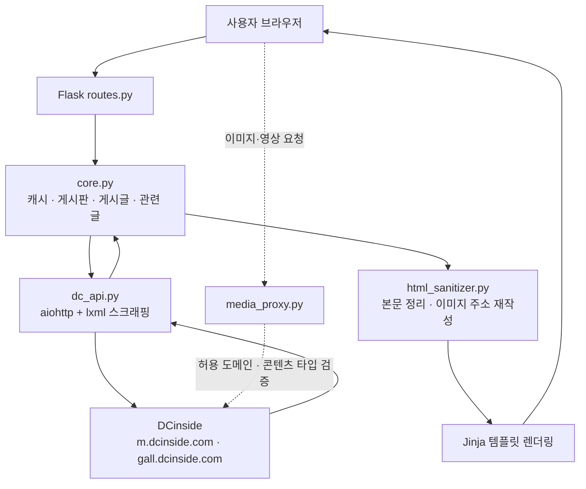

<div align="center">

# 🪞 DCinside Web Mirror

#### 글·이미지·댓글에 집중하는 가볍고 빠른 DCinside 뷰어

DCinside 갤러리를 비동기로 스크래핑해 깔끔하게 정리하고,<br/>
안정적인 미디어 프록시 위에서 부드럽게 읽도록 만든 Flask 기반 미러입니다.

<br/>

<a href="https://www.python.org/"></a>
<a href="https://flask.palletsprojects.com/"></a>
<a href="https://docs.aiohttp.org/"></a>
<a href="https://lxml.de/"></a>
<a href="https://gunicorn.org/"></a>
<a href="https://pm2.keymetrics.io/"></a>

<br/>

**[빠른 시작](#-빠른-시작)** &nbsp;·&nbsp; **[기능](#-기능)** &nbsp;·&nbsp; **[작동 방식](#-작동-방식)** &nbsp;·&nbsp; **[환경 변수](#%EF%B8%8F-환경-변수)** &nbsp;·&nbsp; **[배포](#%EF%B8%8F-배포)**

</div>

<br/>

```
┌──────────────┐     ┌──────────────┐     ┌──────────────┐     ┌──────────────┐
│   브라우저    │ ──▶ │  Flask 라우트 │ ──▶ │ 비동기 스크래퍼 │ ──▶ │   DCinside    │
│              │ ◀── │  + 캐시 계층  │ ◀── │  aiohttp+lxml │ ◀── │              │
└──────────────┘     └──────────────┘     └──────────────┘     └──────────────┘
        ▲                    │
        └────── 정리된 HTML · 미디어 프록시 ──────┘
```

<br/>

## 🚀 빠른 시작

```bash
git clone https://github.com/oneulddu/dcinside-web-mirror.git
cd dcinside-web-mirror

python3 -m venv .venv && source .venv/bin/activate
make install          # 의존성 설치
make run              # 개발 서버 → http://127.0.0.1:8080
```

<details>
<summary><b>환경 변수 빠른 설정</b></summary>

<br/>

`.env.example`을 복사한 뒤 로컬에서는 보통 아래 정도면 충분합니다.

```dotenv
MIRROR_ENV=development
MIRROR_HOST=127.0.0.1
MIRROR_PORT=8080
```

> 운영 배포 시 `MIRROR_SECRET_KEY`는 반드시 안전한 임의 문자열로 교체하세요.

</details>

<details>
<summary><b>Makefile 명령어</b></summary>

<br/>

| 명령 | 설명 |
|---|---|
| `make install` | 실행 의존성 설치 |
| `make install-dev` | 테스트·개발 의존성까지 설치 |
| `make run` | 개발 서버(Flask 자동 리로드) |
| `make run-prod` | Gunicorn 실행 |
| `make test` | pytest 실행 |

</details>

<br/>

## ✨ 기능

<table>
<tr>
<td width="50%" valign="top">

**🔥 흥한 갤러리**
대흥갤·흥한갤 목록을 첫 화면에 노출하고 파일 캐시로 빠르게 제공합니다.

**📋 게시판 목록**
전체글 / 추천글 전환, 페이지 이동, 검색어 하이라이트를 지원합니다.

**📖 게시글 읽기**
본문·이미지·댓글·대댓글을 읽기 좋은 화면으로 정리합니다.

**🔗 관련 글 이어보기**
현재 글 주변 페이지를 탐색해 자연스러운 무한 스크롤을 만듭니다.

**🌙 테마 · 읽음 상태**
라이트·다크 전환과 읽은 글 표시를 브라우저에 저장합니다.

</td>
<td width="50%" valign="top">

**🔎 갤러리 검색**
갤러리 이름이나 게시판 ID로 한 번에 이동합니다.

**🏷️ 분류 탭 필터**
게시글 말머리(카테고리) 탭으로 원하는 글만 골라 봅니다.

**🖼️ 미디어 프록시**
이미지·webp·동영상·디시콘을 서버가 대신 가져와 안정적으로 표시합니다.

**🕘 최근 방문 갤러리**
쿠키 기반으로 최근 방문 갤러리를 최대 30개까지 보관합니다.

**🛡️ 댓글 스팸 필터**
클라이언트에서 반복성 댓글을 줄여 노출합니다.

</td>
</tr>
</table>

<br/>

## 🧭 라우트

| 화면 | 주소 |
|---|---|
| 홈 (흥한 갤러리·검색) | `/` |
| 최근 방문 | `/recent` |
| 게시판 목록 | `/board?board=airforce&page=1` |
| 게시글 읽기 | `/read?board=airforce&pid=12345` |
| 관련 글 (JSON) | `/read/related` |
| 이미지 프록시 | `/media` |
| 영상 프록시 | `/movie` |

<br/>

## ⚙️ 작동 방식



1. 사용자가 게시판 / 글 주소에 접속합니다.
2. Flask 라우트가 입력값을 정규화하고 비동기 작업을 시작합니다.
3. `core.py`가 캐시를 확인한 뒤 부족한 부분만 `dc_api.py`로 조회합니다.
4. 스크래퍼가 DCinside HTML에서 게시글·댓글·이미지를 추출합니다.
5. 본문 HTML은 허용 목록 기반으로 정리되어 XSS를 차단합니다.
6. 이미지·영상은 `/media`, `/movie` 프록시 주소로 다시 쓰여 브라우저로 전달됩니다.

<br/>

## 🧠 설계 포인트

| | |
|---|---|
| **비동기 스크래핑** | `aiohttp` + `lxml`로 목록·본문·댓글·작성자 코드를 병렬 조회하고, `async_bridge`가 Flask 동기 라우트와 asyncio를 안전하게 잇습니다. |
| **다층 캐시** | 흥한 갤러리 파일 캐시, 최신 글 ID, 관련 글 탐색, 작성자 코드, 게시판 페이지 짧은 캐시, 최근 방문 보조 캐시가 함께 동작해 반복 요청을 줄입니다. |
| **관련 글 탐색** | 현재 글 위치를 기준으로 주변 페이지를 탐색하고, 부족하면 뒤쪽 페이지를 보충해 자연스러운 이어 읽기를 만듭니다. |
| **안전한 프록시** | 허용 도메인 접미사, DNS 공인 IP 여부, 리다이렉트 횟수, 응답 크기, 콘텐츠 타입을 모두 검증한 뒤 미디어를 전달합니다. |

<br/>

## 🏗️ 구조

```text
mirror/
├── app/
│   ├── __init__.py            # Flask 앱 팩토리
│   ├── config.py              # 개발·운영 설정
│   ├── routes.py              # 화면 라우트 · 프록시 연결
│   ├── services/
│   │   ├── async_bridge.py    # 동기 ↔ asyncio 연결
│   │   ├── core.py            # 게시판·게시글·관련 글 + 캐시
│   │   ├── dc_api.py          # DCinside 비동기 스크래퍼
│   │   ├── heung.py           # 흥한 갤러리 + 파일 캐시
│   │   ├── html_sanitizer.py  # 본문 정리 · 이미지 주소 재작성
│   │   ├── media_proxy.py     # 미디어 프록시 + SSRF 검증
│   │   └── recent.py          # 최근 방문 쿠키 관리
│   ├── templates/             # base · index · board · read · recent
│   └── static/                # main.css · 테마/읽음/관련글/스팸 JS
├── tests/                     # pytest 테스트
├── docs/                      # 설계·운영 문서
├── run.py · wsgi.py           # 개발 / 운영 진입점
├── gunicorn.conf.py · ecosystem.config.js
└── Makefile
```

<br/>

## ⚙️ 환경 변수

`.env.example`을 복사해 `.env`를 만든 뒤 필요한 값만 바꿉니다.

<details>
<summary><b>실행 / 서버</b></summary>

<br/>

| 변수 | 기본값 | 설명 |
|---|---:|---|
| `MIRROR_ENV` | `production` | 실행 환경. 개발은 `development` |
| `MIRROR_HOST` | `0.0.0.0` | 개발 서버 바인드 호스트 |
| `MIRROR_PORT` | `8080` | 개발 서버 포트 |
| `MIRROR_BIND` | `[::]:6100` | Gunicorn 바인드 주소 |
| `MIRROR_WORKERS` | CPU×2+1 | Gunicorn 워커 수 |
| `MIRROR_THREADS` | `4` | 워커당 스레드 |
| `MIRROR_TIMEOUT` | `60` | 요청 제한 시간 |
| `MIRROR_LOG_LEVEL` | `info` | Gunicorn 로그 레벨 |
| `MIRROR_SECRET_KEY` | — | 운영에서 반드시 설정 |
| `MIRROR_PUBLIC_BASE_URL` | — | URL 미리보기용 공개 기본 주소. 예: `https://example.com` |

</details>

<details>
<summary><b>스크래핑 / 캐시</b></summary>

<br/>

| 변수 | 기본값 | 설명 |
|---|---:|---|
| `MIRROR_HTTP_TIMEOUT` | `20` | DCinside 요청 타임아웃 |
| `MIRROR_DC_CONN_LIMIT` | `20` | DCinside 공유 세션 커넥션 제한 |
| `MIRROR_DC_DNS_CACHE_TTL` | `60` | DCinside 공유 세션 DNS 캐시 유지 시간 |
| `MIRROR_HEUNG_CACHE_TTL` | `3600` | 흥한 갤러리 캐시 유지 시간 |
| `MIRROR_HEUNG_CACHE_FILE` | `instance/heung_gallery_cache.json` | 캐시 파일 경로 |
| `MIRROR_BOARD_PAGE_CACHE_TTL` | `20` | 게시판 페이지 짧은 캐시 |
| `MIRROR_BOARD_FILL_AUTHOR_CODES` | `0` | 게시판 목록에서 캐시된 작성자 코드 보강 |
| `MIRROR_BOARD_KIND_CACHE_TTL` | `21600` | 게시판 URL 후보 성공 패턴 캐시 |
| `MIRROR_RELATED_PAGE_PROBE_STEPS` | `4` | 관련 글 주변 탐색 페이지 수 |
| `MIRROR_RELATED_TAIL_PAGES` | `1` | 관련 글 뒤쪽 보충 페이지 |
| `MIRROR_ASYNC_BRIDGE_WORKERS` | `2` | async bridge 보조 실행자 수 |

</details>

<details>
<summary><b>미디어 프록시</b></summary>

<br/>

| 변수 | 기본값 | 설명 |
|---|---:|---|
| `MIRROR_MEDIA_CACHE_MAX_AGE` | `86400` | 브라우저 캐시 시간 |
| `MIRROR_MEDIA_MAX_BYTES` | `52428800` | 최대 응답 크기 (50 MiB) |
| `MIRROR_MEDIA_CHUNK_BYTES` | `262144` | 스트리밍·버퍼링 청크 크기 |
| `MIRROR_MEDIA_STREAMING_MIN_BYTES` | `1048576` | 이 크기 이상이면 스트리밍 |
| `MIRROR_MEDIA_REDIRECT_LIMIT` | `3` | 허용 리다이렉트 횟수 |
| `MIRROR_MEDIA_ALLOWED_HOST_SUFFIXES` | `dcinside.com,dcinside.co.kr` | 허용 도메인 접미사 |

</details>

<details>
<summary><b>최근 방문</b></summary>

<br/>

| 변수 | 기본값 | 설명 |
|---|---:|---|
| `MIRROR_RECENT_MAX_ITEMS` | `30` | 최대 저장 개수 |
| `MIRROR_RECENT_COOKIE_TTL` | `2592000` | 쿠키 유지 시간 (30일) |
| `MIRROR_RECENT_SERVER_CACHE_TTL` | `86400` | 서버 보조 캐시 TTL |
| `MIRROR_RECENT_SERVER_CACHE_MAX_KEYS` | `2048` | 보조 캐시 최대 키 수 |

</details>

<br/>

## 🖥️ 배포

```bash
# Gunicorn 직접 실행
gunicorn -c gunicorn.conf.py wsgi:app

# PM2 관리 (파일 변경 감시 · 자동 재시작)
pm2 start ecosystem.config.js && pm2 save && pm2 startup
```

`main` 브랜치에 push하면 `.github/workflows/deploy.yml`이 테스트 → SSH 배포까지 자동으로 수행합니다.

<br/>

## ✅ 테스트

```bash
make install-dev
make test
```

`pytest` + `pytest-asyncio` 기반이며, `tests/`에 라우트·서비스·프록시 검증 케이스가 들어 있습니다.

<br/>

## 🔒 보안

- **SSRF 방어** — 허용 도메인 접미사, DNS 결과의 공인 IP 여부, 리다이렉트 횟수를 검증합니다.
- **XSS 방어** — 본문 HTML을 허용 목록으로 정리하고 `on*` 핸들러·`javascript:` 스킴을 제거합니다.
- **콘텐츠 타입 검증** — 이미지·영상·오디오 응답만 프록시하고 `X-Content-Type-Options: nosniff`를 설정합니다.
- **쿠키 보안** — 최근 방문 쿠키에 `SameSite=Lax`, HTTPS에서는 `Secure`를 적용합니다.
- **입력값 정규화** — 게시판 ID·갤러리 종류·페이지·글 번호를 라우트 진입 시점에 검증합니다.

<br/>

## 🛠️ 기술 스택

`Python 3.9+` · `Flask 3.1` · `Gunicorn 23` · `aiohttp` · `asgiref` · `lxml` · `BeautifulSoup4` · `Jinja2` · `Pretendard` · `PM2` · `pytest` · `GitHub Actions`

<br/>

---

<div align="center">

이 프로젝트는 [mirusu400/dcinside-web-mirror](https://github.com/mirusu400/dcinside-web-mirror)를 기반으로 커스텀·개선한 버전입니다.

<br/>

**조용히, 빠르게, 읽기 좋게 — DCinside를 다시 보다 🪞**

</div>
